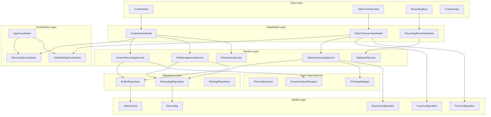

# Kiroku Coding Style Guide

## Overview
This document defines the strict coding standards and architectural patterns for the Kiroku codebase. All code must adhere to these guidelines to ensure consistency, maintainability, and testability.

## Architecture Pattern: MVVM-C (Model-View-ViewModel-Coordinator)

### Core Principles
1. **Separation of Concerns**: Each component has a single, well-defined responsibility
2. **Dependency Injection**: All dependencies are injected, never created internally
3. **Protocol-Oriented**: Use protocols for all service interfaces
4. **Immutable State**: Prefer immutable data structures
5. **Reactive State Management**: Use `@Published` and `ObservableObject` for state
6. **Testability First**: Every component must be independently testable

### Architecture Diagram



## Component Structure

### 1. Models
```swift
// MARK: - Model
struct Recording: Identifiable, Codable, Equatable {
    let id: UUID
    let url: URL
    let createdAt: Date
    let duration: TimeInterval
    let fileSize: Int64
    let type: RecordingType
    
    enum RecordingType: String, Codable {
        case video = "video"
        case gif = "gif"
    }
}
```

### 2. ViewModels
```swift
// MARK: - ViewModel
@MainActor
final class ContentViewModel: ObservableObject {
    // MARK: - Published Properties
    @Published private(set) var recordings: [Recording] = []
    @Published private(set) var isRecording = false
    @Published private(set) var hasPermission = false
    
    // MARK: - Dependencies
    private let recordingService: ScreenRecordingServiceProtocol
    private let fileService: FileManagementServiceProtocol
    private let coordinator: RecordingCoordinatorProtocol
    
    // MARK: - Initialization
    init(
        recordingService: ScreenRecordingServiceProtocol,
        fileService: FileManagementServiceProtocol,
        coordinator: RecordingCoordinatorProtocol
    ) {
        self.recordingService = recordingService
        self.fileService = fileService
        self.coordinator = coordinator
    }
    
    // MARK: - Public Methods
    func startRecording() async throws {
        // Implementation
    }
}
```

### 3. Views
```swift
// MARK: - View
struct ContentView: View {
    @StateObject private var viewModel: ContentViewModel
    
    init(viewModel: ContentViewModel) {
        self._viewModel = StateObject(wrappedValue: viewModel)
    }
    
    var body: some View {
        // View implementation
    }
}
```

### 4. Services
```swift
// MARK: - Service Protocol
protocol ScreenRecordingServiceProtocol: AnyObject {
    var isRecording: AnyPublisher<Bool, Never> { get }
    func startRecording() async throws
    func stopRecording() async throws
    func exportLastMinute() async throws -> URL
}

// MARK: - Service Implementation
final class ScreenRecordingService: ScreenRecordingServiceProtocol {
    // MARK: - Dependencies
    private let processExecutor: ProcessExecutorProtocol
    private let bufferRepository: BufferRepositoryProtocol
    
    // MARK: - Initialization
    init(
        processExecutor: ProcessExecutorProtocol,
        bufferRepository: BufferRepositoryProtocol
    ) {
        self.processExecutor = processExecutor
        self.bufferRepository = bufferRepository
    }
}
```

### 5. Coordinators
```swift
// MARK: - Coordinator Protocol
protocol RecordingCoordinatorProtocol: AnyObject {
    func showVideoTrimmer(for recording: Recording)
    func showExportOptions(for recording: Recording)
}

// MARK: - Coordinator Implementation
final class RecordingCoordinator: RecordingCoordinatorProtocol {
    weak var navigationController: NSViewController?
    
    func showVideoTrimmer(for recording: Recording) {
        // Navigation logic
    }
}
```

## Naming Conventions

### Files
- **Views**: `[Feature]View.swift` (e.g., `ContentView.swift`)
- **ViewModels**: `[Feature]ViewModel.swift` (e.g., `ContentViewModel.swift`)
- **Services**: `[Feature]Service.swift` (e.g., `ScreenRecordingService.swift`)
- **Models**: `[Entity].swift` (e.g., `Recording.swift`)
- **Coordinators**: `[Feature]Coordinator.swift` (e.g., `RecordingCoordinator.swift`)

### Properties and Methods
- **Private properties**: Start with underscore for stored properties only
- **Published properties**: Always mark as `private(set)` when external modification isn't needed
- **Async methods**: Use `async throws` pattern consistently
- **Completion handlers**: Prefer async/await over callbacks

## Code Organization

### 1. File Structure
```
kiroku/
├── App/
│   ├── kirokuApp.swift
│   └── AppCoordinator.swift
├── Core/
│   ├── Models/
│   ├── Services/
│   ├── Repositories/
│   └── Utilities/
├── Features/
│   ├── Recording/
│   │   ├── Views/
│   │   ├── ViewModels/
│   │   └── Coordinators/
│   └── VideoEditing/
│       ├── Views/
│       ├── ViewModels/
│       └── Coordinators/
└── Resources/
```

### 2. Within Files
```swift
// MARK: - Imports
import SwiftUI
import Combine

// MARK: - Protocols
protocol SomeProtocol { }

// MARK: - Main Type
struct/class/enum MainType {
    // MARK: - Nested Types
    
    // MARK: - Properties
    
    // MARK: - Initialization
    
    // MARK: - Public Methods
    
    // MARK: - Private Methods
}

// MARK: - Extensions
extension MainType { }
```

## Error Handling

### 1. Define Domain-Specific Errors
```swift
enum RecordingError: LocalizedError {
    case permissionDenied
    case ffmpegNotFound
    case exportFailed(underlying: Error)
    
    var errorDescription: String? {
        switch self {
        case .permissionDenied:
            return "Screen recording permission is required"
        case .ffmpegNotFound:
            return "FFmpeg is not installed"
        case .exportFailed(let error):
            return "Export failed: \(error.localizedDescription)"
        }
    }
}
```

### 2. Error Propagation
- Use `Result` types for synchronous operations
- Use `async throws` for asynchronous operations
- Never use force unwrapping or `try!`

## Testing Guidelines

### 1. Testable Design
- All business logic in ViewModels and Services
- Views should be purely declarative
- Use protocol boundaries for mocking

### 2. Dependency Injection
```swift
// MARK: - DI Container
final class DIContainer {
    // Services
    lazy var screenRecordingService: ScreenRecordingServiceProtocol = {
        ScreenRecordingService(
            processExecutor: processExecutor,
            bufferRepository: bufferRepository
        )
    }()
    
    // ViewModels
    func makeContentViewModel() -> ContentViewModel {
        ContentViewModel(
            recordingService: screenRecordingService,
            fileService: fileManagementService,
            coordinator: recordingCoordinator
        )
    }
}
```

## SwiftUI Best Practices

### 1. View Composition
- Keep views small and focused
- Extract reusable components
- Use ViewBuilders for complex layouts

### 2. State Management
- Use `@StateObject` for view-owned ViewModels
- Use `@ObservedObject` for injected ViewModels
- Minimize `@State` usage to UI-only state

### 3. Performance
- Use `LazyVStack`/`LazyHStack` for lists
- Implement `Equatable` on models
- Use `.id()` modifier sparingly

## Async/Await Patterns

### 1. Task Management
```swift
final class SomeViewModel: ObservableObject {
    private var currentTask: Task<Void, Never>?
    
    func performAction() {
        currentTask?.cancel()
        currentTask = Task { @MainActor in
            do {
                try await someAsyncOperation()
            } catch {
                // Handle error
            }
        }
    }
    
    deinit {
        currentTask?.cancel()
    }
}
```

### 2. Concurrent Operations
```swift
func exportVideos(_ urls: [URL]) async throws -> [URL] {
    try await withThrowingTaskGroup(of: URL.self) { group in
        for url in urls {
            group.addTask {
                try await self.exportVideo(url)
            }
        }
        
        var results: [URL] = []
        for try await result in group {
            results.append(result)
        }
        return results
    }
}
```

## Forbidden Patterns

1. **No Singletons**: Use dependency injection instead
2. **No Global State**: All state must be scoped
3. **No Force Unwrapping**: Use proper optional handling
4. **No Massive Views**: Break down into components
5. **No Business Logic in Views**: Move to ViewModels
6. **No Direct File System Access in Views**: Use services
7. **No Hardcoded Strings**: Use constants or localization
8. **No Mixed Concerns**: Each type has one responsibility

## Code Review Checklist

- [ ] Follows MVVM-C architecture
- [ ] All dependencies are injected
- [ ] Proper error handling implemented
- [ ] No force unwrapping
- [ ] Async operations properly managed
- [ ] Views are purely declarative
- [ ] Business logic in appropriate layer
- [ ] Proper MARK comments
- [ ] Consistent naming conventions
- [ ] Testable design